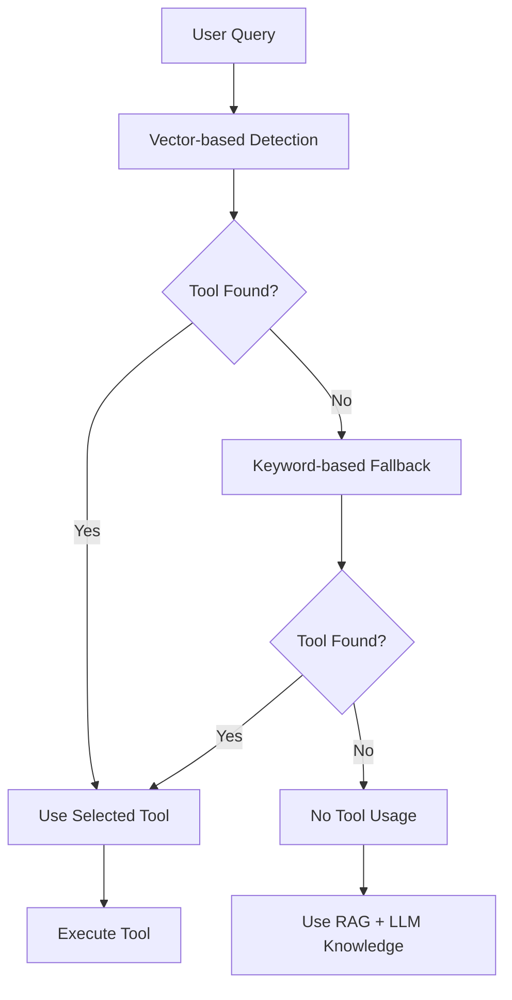

# Tool Selection Logic in Funes

This document explains how Funes determines when and which tools to use when processing user queries.

## Overview

Funes uses a **hybrid approach** for tool selection that combines multiple detection methods to maximize accuracy while providing graceful fallback when no tools are applicable.

## Tool Selection Architecture

### 1. Dual Detection System

The system employs two complementary methods that work together:

#### Vector-Based Tool Selection (Primary Method)
- **Location**: `should_use_tools_vector()` in `llm_utilities.py`
- **How it works**: 
  - Uses embedding similarity to match user queries with tool descriptions
  - Generates embeddings for the user message using the embedding manager
  - Compares with stored tool embeddings in the database
  - Default similarity threshold: 0.6 (configurable)
- **Advantages**: More sophisticated semantic understanding
- **Limitations**: Can miss edge cases or be too broad in matching

#### Keyword-Based Tool Selection (Fallback Method)
- **Location**: `should_use_tools()` in `llm_utilities.py`
- **How it works**: Uses regex patterns to detect information-seeking queries
- **Detection patterns**:
  - Direct tool name mentions in user input
  - Information-seeking patterns:
    - `"what is (?:the|current) (.+)"`
    - `"how (?:many|much) (.+)"`
    - `"when is (.+)"`
    - `"where is (.+)"`
    - `"(?:can you )?(?:tell|show) me (?:the|about) (.+)"`
    - `"(?:can you )?(?:get|fetch|find|search for) (.+)"`
    - `"(current|latest|today's) (.+)"`
    - `"(.+) right now"`
- **Advantages**: Reliable for obvious patterns, fast execution
- **Limitations**: Can be too broad or miss nuanced queries

### 2. Selection Process Flow



1. **Vector-based detection runs first** with similarity threshold of 0.6
2. **If no tool is found**, system falls back to keyword-based detection
3. **If either method suggests using tools**, system proceeds with tool execution
4. **Tool name resolution** uses fuzzy matching:
   - Case-insensitive matching
   - Prefix handling (`get_` prefix optional)
   - Partial name matching for tool names within queries

### 3. What Happens When No Tool Matches

When no tool matches the user question, the system follows this graceful degradation path:

#### In Memory Manager (`memory_manager.py`):
```python
# If not a tool query, retrieve memories instead
if not is_tool_query:
    long_term_memories = self.retrieve_relevant_memories(user_message)
```

#### In LLM Handler (`llm_handler.py`):
- The LLM is called **without any tools** being passed to it
- The system message includes general instructions but no tool-specific prompts
- Response generation relies on:
  1. **Retrieved memories** from the RAG system
  2. **LLM's training knowledge**
  3. **Conversation context**

#### Response Generation:
- LLM generates response using only training data and provided context
- No tool execution occurs
- Response returned as plain text without tool enhancement

## Configuration

### Key Settings in `config.py`:
```python
'tool_use_prompt': "You have access to the following tools... Only use these tools when necessary, such as for getting real-time information..."
'vector_tool_selection': True  # Enables the vector-based approach
```

### Similarity Threshold:
- Default: 0.75 for vector-based selection
- Configurable in `memory_manager.py` when calling `should_use_tools_vector()`

## Tool Resolution and Execution

### Tool Name Resolution (`tools/__init__.py`)
The `get_tool()` function provides flexible tool name resolution:

1. **Exact name matching**
2. **Variation mapping** (backward compatibility)
3. **Prefix handling** (`get_` prefix optional)
4. **Case-insensitive matching**
5. **Partial name matching** for commands containing tool names

### Tool Execution Flow
1. Tool is resolved by name
2. Function arguments are extracted from LLM response
3. Tool function is called with arguments
4. Tool output is processed and enhanced
5. Final response is generated incorporating tool results

## Graceful Degradation Strategy

The system is designed to **always provide a response**:

- **Vector detection fails** → Falls back to keyword-based detection
- **Keyword detection fails** → Proceeds without tools
- **Tool execution fails** → Returns error message but continues
- **No tools match** → Uses RAG memories and LLM knowledge
- **No memories found** → Uses LLM training knowledge

## Known Issues and Limitations

### Current Problems:
1. **Over-broad matching**: Queries like "How many people live in Moscow, Russia?" incorrectly match weather tool due to location mention
2. **Vector similarity threshold**: May need fine-tuning for different types of queries
3. **Keyword patterns**: Some information-seeking patterns are too general

### Potential Improvements:
1. **More specific tool descriptions** for better vector matching
2. **Tool-specific keyword patterns** instead of general information-seeking patterns
3. **Intent classification** before tool selection
4. **Negative matching** to exclude certain query types from tool usage

## Example Scenarios

### Correct Tool Usage:
- "What's the weather in Paris?" → Weather tool ✓
- "What time is it now?" → DateTime tool ✓

### Incorrect Tool Usage:
- "How many people live in Moscow, Russia?" → Weather tool ✗ (should use no tools)
- "Tell me about the history of Moscow" → Weather tool ✗ (should use no tools)

### No Tool Usage (Correct):
- "What is artificial intelligence?" → No tools, use LLM knowledge ✓
- "Explain quantum physics" → No tools, use LLM knowledge ✓

## Debugging Tool Selection

To debug tool selection issues:

1. Check logs for tool selection decisions
2. Test both vector and keyword-based selection separately
3. Verify tool descriptions and embeddings
4. Adjust similarity thresholds if needed
5. Review regex patterns for keyword matching

## Files Involved

- `llm_utilities.py`: Core tool selection logic
- `memory_manager.py`: Integration and orchestration
- `llm_handler.py`: Tool execution and response generation
- `tools/__init__.py`: Tool registration and resolution
- `config.py`: Configuration settings
